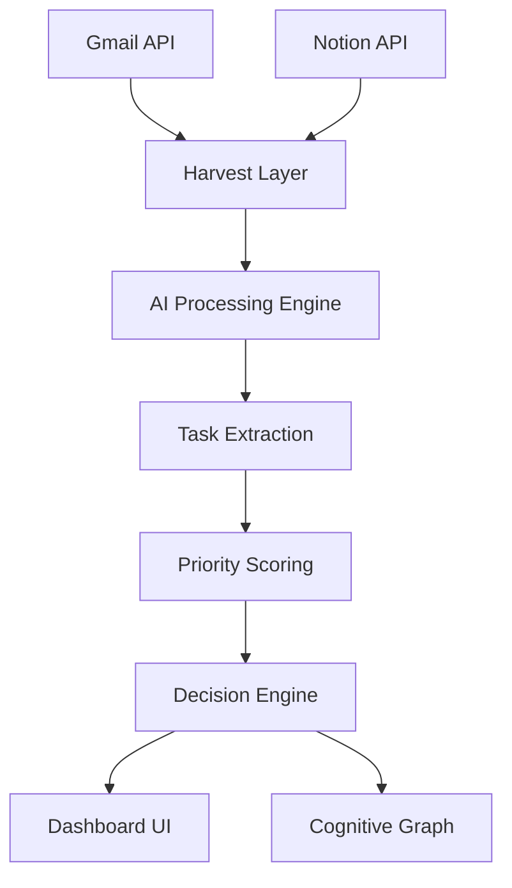

# NEXUS ◈ Cognitive Decision Engine

> **A Personal Operating System that converts information overload into executable decisions.**

---

## 🧠 What NEXUS Actually Does

Modern workflows are broken.

* You read emails → forget tasks
* You write notes → never revisit
* You juggle priorities → lose focus

**NEXUS fixes this.**

It acts as a **Cognitive Layer on top of your tools**, transforming:

```
Emails + Notes + Context → Structured Decisions
```

Instead of showing data, it answers:

> **“What should I do right now?”**

---

## ⚡ Core Philosophy

NEXUS is not:

* ❌ a dashboard
* ❌ a task manager
* ❌ another productivity app

It is:

> ✅ A **Decision Engine**
> ✅ A **Cognitive Load Reducer**
> ✅ A **Personal Intelligence System**

---

## 🧠 Cognitive Intelligence Pipeline

NEXUS operates as a **multi-agent reasoning system**:

### 1. 🧹 Harvest Layer (Noise Elimination)

* Gmail ingestion (filters promotions, spam, newsletters)
* Notion workspace ingestion (pages, tasks, docs)
* Only **human-relevant signals** pass through

---

### 2. 🧠 Cognitive Understanding (LLM Reasoning)

Using **GPT-4o-mini**, NEXUS:

* Extracts **intent**
* Converts text → **structured tasks**
* Infers:

  * urgency
  * deadlines
  * actionability

Example:

```
"Submit assignment by tonight"
→ Task: Submit assignment
→ Priority: DO NOW
```

---

### 3. ⚖️ Deduplication & Priority Scoring

* Cross-source merging (Gmail + Notion)
* Priority boost for repeated signals
* Scoring system:

  * Multi-source relevance → +20 weight
  * Time-sensitive → high priority

---

### 4. 🎯 Decision Engine

Tasks are automatically classified into:

* 🔴 **DO NOW** → Immediate execution
* 🟡 **DO NEXT** → Near-term planning
* ⚪ **LATER** → Low urgency / backlog

---

### 5. 🧩 Cognitive Graph Mapping

* Force-directed graph visualization
* Shows:

  * dependencies
  * source connections
  * priority clusters

---

## ✨ Key Features

### 🧠 Intelligence

* Real-time **AI task extraction**
* Context-aware prioritization
* Multi-source reasoning

---

### ✉️ Gmail Integration

* Smart email filtering
* Removes:

  * promotions
  * spam
  * newsletters
* Extracts only **actionable communication**

---

### 📝 Notion Integration

* Syncs workspace pages
* Extracts:

  * tasks
  * notes
  * project context
* Converts unstructured notes → decisions

---

### ⚛️ Decision Dashboard

* Minimal 3-column UI:

  * DO NOW
  * DO NEXT
  * LATER
* Designed for:

  * **zero cognitive overload**
  * instant clarity

---

### 🌐 Cognitive Graph (Advanced UI)

* Interactive node-based visualization
* Features:

  * zoom & focus
  * node inspection
  * dependency tracking
  * real-time updates

---

### 🤖 Agent Orchestration Engine

Pipeline stages:

```
HARVEST → THINK → DECIDE → OUTPUT
```

* Live progress tracking
* State-driven execution
* Transparent AI workflow

---

### 🔐 Multi-User OAuth System

* Secure login via:

  * Google (Gmail)
  * Notion
* Per-user token storage
* Scalable integration layer

---

## 🧪 System Architecture



---

## 🛠 Tech Stack

### Frontend

* React (Vite)
* TypeScript
* Tailwind CSS
* Framer Motion
* Zustand (state management)

---

### Visualization

* React-Force-Graph-2D
* Custom node rendering
* Dynamic graph interactions

---

### Backend

* Node.js
* Express.js
* OpenAI (GPT-4o-mini)

---

### Integrations

* Google Cloud (Gmail API + OAuth)
* Notion API + OAuth

---

## 🚀 Installation & Setup

### 1. Clone Repo

```bash
git clone https://github.com/Dakshin10/Nexus-Ai.git
cd Nexus-Ai
```

---

### 2. Backend Setup

```bash
cd backend
npm install
```

Create `.env`:

```env
NOTION_CLIENT_ID=
NOTION_CLIENT_SECRET=
NOTION_REDIRECT_URI=http://localhost:3001/auth/notion/callback

GOOGLE_CLIENT_ID=
GOOGLE_CLIENT_SECRET=
GOOGLE_REDIRECT_URI=http://localhost:3001/auth/gmail/callback

OPENAI_API_KEY=
PORT=3001
FRONTEND_URL=http://localhost:5173
```

Run:

```bash
npm run dev
```

---

### 3. Frontend Setup

```bash
cd Nexus
npm install
npm run dev
```

---

## 🌐 API Endpoints

| Endpoint                      | Description              |
| ----------------------------- | ------------------------ |
| `/api/agent/run-intelligence` | Run full AI pipeline     |
| `/api/gmail/emails`           | Fetch filtered emails    |
| `/api/notion/pages`           | Fetch Notion data        |
| `/api/agent/status`           | Real-time pipeline state |

---

## 🎯 Real-World Impact

Without NEXUS:

* 50+ emails → manual reading
* Tasks scattered across apps
* Decision fatigue

With NEXUS:

* 50 inputs → **3 clear actions**
* Instant clarity
* Reduced cognitive load

---

## 🧠 What Makes This Different

* Not just aggregation → **interpretation**
* Not just tasks → **decisions**
* Not just UI → **thinking system**

---

## 🔮 Future Scope

* Slack / Calendar integration
* Temporal reasoning (time-based prioritization)
* Self-improving agents
* Long-horizon planning
* Personal memory graph

---

## 📜 License

MIT License

---

## ❤️ Built For

* Developers
* Founders
* Students
* High-performance operators

---

> **Stop managing tasks. Start executing decisions.**
